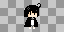

# Alice

Unity game. This repository contains the materials used in the game.

## Previews

## Description

Includes artwork, background music and code.

**Artwork**:

Characters and Enimies - me

Background - Free Material

**Background music**: Fly me to the star & Beethoven

**Code**: me

## More

It's best not to try to read/understand the text. I (somehow) have the outline, but there's basically no continuity in the context in the game.